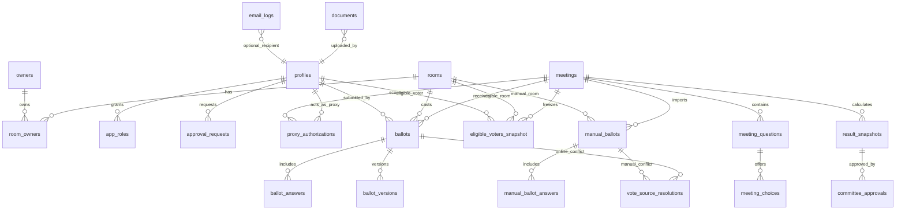

# Data Model

This is the initial relational model. Names may change during implementation, but domain boundaries should stay stable.

## User Roles

| Role | Purpose | Vote Permission |
| --- | --- | --- |
| Admin | Manages master data, meetings, questions, choices, approvals, and result publication. | Can manage votes but should not vote unless also eligible as owner/proxy. |
| Committee | Reviews calculated results and approves publication. | Same as normal user unless separately eligible. |
| Owner | Verified room owner. | Can vote for owned room. |
| Proxy | Approved representative for a specific meeting and room. | Can vote for assigned room only during the authorized meeting. |
| Resident | Occupant without ownership rights. | Cannot vote unless approved as proxy. |

## ERD Summary

## Core Tables

| Table | Purpose |
| --- | --- |
| [condo_profiles](#condo_profiles) | Juristic person profile used as the issuer identity for formal documents and PDFs. |
| [committee_members](#committee_members) | Real committee roster and positions for document approval/signature context. |
| [rooms](#rooms) | Master data for condominium units. Used as the base voting right because one room equals one vote. |
| [owners](#owners) | Master data for legal owners from juristic office records or verified admin input. |
| [room_owners](#room_owners) | Links owners to rooms and supports ownership history or co-owner cases. |
| [profiles](#profiles) | Application user profile linked to Supabase Auth identity. |
| [app_roles](#app_roles) | Assigns system roles such as admin and committee to profiles. |
| [approval_requests](#approval_requests) | Tracks user requests to become an approved owner, resident, or proxy voter. |
| [proxy_authorizations](#proxy_authorizations) | Meeting-specific proxy permissions allowing a non-owner to vote for a room. |
| [meetings](#meetings) | Voting event or condominium meeting configuration. |
| [meeting_questions](#meeting_questions) | Questions shown inside a meeting vote/survey. |
| [meeting_choices](#meeting_choices) | Choices available for each meeting question. |
| [eligible_voters_snapshot](#eligible_voters_snapshot) | Frozen voter eligibility list for a meeting. Used to make result calculation auditable. |
| [ballots](#ballots) | Current ballot record per meeting and room. |
| [ballot_answers](#ballot_answers) | Current effective answers for a ballot. |
| [ballot_versions](#ballot_versions) | Historical ballot payloads whenever a voter edits before close. |
| [manual_ballots](#manual_ballots) | Admin-imported paper/offline ballot record per meeting and room. |
| [manual_ballot_answers](#manual_ballot_answers) | Current effective answers for an imported manual ballot. |
| [vote_source_resolutions](#vote_source_resolutions) | Admin decision record when the same room has both online and manual votes. |
| [result_snapshots](#result_snapshots) | Calculated result payloads for a meeting before/after approval. |
| [committee_approvals](#committee_approvals) | Approval record that makes a result visible to viewers. |
| [documents](#documents) | Private file references for owner/proxy approval and generated PDFs. |
| [email_logs](#email_logs) | Delivery log for invitations, reminders, and result notifications. |

SQL draft: [schema-draft.sql](schema-draft.sql). This is not final and must be reviewed before migration.

## Table Notes

This section explains table responsibilities at the domain level. Column types and migration details live in [schema-draft.sql](schema-draft.sql).

### rooms
Purpose: Stores one condominium unit.
Key fields: room number, floor/building, area size, ownership percentage, active flag.
Notes: Source of truth for one-room-one-vote and ownership-weighted result calculation.

### condo_profiles
Purpose: Stores the juristic-person/project identity printed on formal documents.
Key fields: juristic name, project name, registration number, tax ID, address, contact channels, manager name, document footer.
Notes: Keep this separate from app config because it is legal/business data, not application branding.

### committee_members
Purpose: Stores actual committee member names and positions.
Key fields: profile link, full name, position title, term dates, display order, active flag.
Notes: This is document and governance data. `app_roles` remains system authorization only.

### owners
Purpose: Stores verified legal owner master data.
Key fields: full name, email, phone, LINE ID, active flag.
Notes: Can come from juristic office records or admin import. Keep separate from login profile.

### room_owners
Purpose: Links owners to rooms.
Key fields: room, owner, ownership role, start/end dates.
Notes: Supports co-owner cases and ownership changes over time.

### profiles
Purpose: Stores app-level user data linked to Supabase Auth.
Key fields: auth user ID, full name, email, phone, LINE ID, default status, approval status.
Notes: A profile is not automatically eligible to vote. Eligibility must come from approval and meeting snapshot.

### app_roles
Purpose: Assigns system-level permissions to profiles.
Key fields: profile, role, granted by, granted timestamp.
Notes: Use this for admin and committee authorization. Do not overload voter status fields for system permissions.

### approval_requests
Purpose: Tracks admin review for user eligibility requests.
Key fields: profile, requested status, room, review status, reviewer, review timestamp.
Notes: Used for owner/resident/proxy onboarding before voting rights are granted.

### proxy_authorizations
Purpose: Grants a proxy right for a specific meeting and room.
Key fields: meeting, room, owner, proxy profile, status, validity window, reviewer.
Notes: Proxy voting is scoped to a meeting, not global.

### meetings
Purpose: Stores each voting event or condominium meeting.
Key fields: title, meeting number, meeting type, fiscal year, location/platform, chairperson, quorum rule, start/end time, status.
Notes: Voting is allowed only inside the configured window after publication. Meeting metadata is copied into result snapshots for PDF/audit use.

### meeting_questions
Purpose: Stores questions configured by admin for a meeting.
Key fields: meeting, agenda number/title, question text, question type, resolution type, required threshold, land-office registration flag, legal note.
Notes: Resolution metadata lets the PDF explain why an agenda passed or failed under the configured rule.

### meeting_choices
Purpose: Stores choices under each question.
Key fields: question, choice text, display order.
Notes: Abstain can be modeled as a normal choice if the requirement confirms it.

### eligible_voters_snapshot
Purpose: Freezes eligible voters for one meeting.
Key fields: meeting, room, profile, voter type, ownership percentage, source.
Notes: Result calculation should use this snapshot instead of live master data so history remains auditable.

### ballots
Purpose: Stores the current ballot record for a meeting and room.
Key fields: meeting, room, voter profile, status, submitted timestamp, version number.
Notes: There should be one effective ballot per meeting and room.

### ballot_answers
Purpose: Stores current effective selected choices for a ballot.
Key fields: ballot, question, choice.
Notes: These are updated when a voter edits before the voting window closes.

### ballot_versions
Purpose: Stores immutable ballot history.
Key fields: ballot, version number, payload snapshot, created timestamp.
Notes: Every submit/edit should create a version for audit.

### manual_ballots
Purpose: Stores imported manual/offline ballot records per meeting and room.
Key fields: meeting, room, importer, source label, audit note, status, imported timestamp.
Notes: Mirrors the online `ballots` table closely enough that result calculation can choose either source per room.

### manual_ballot_answers
Purpose: Stores current effective selected choices for an imported manual ballot.
Key fields: manual ballot, question, choice.
Notes: Mirrors `ballot_answers`. One answer is stored per manual ballot and question.

### vote_source_resolutions
Purpose: Stores admin conflict decisions when a room has both online and manual vote sources.
Key fields: meeting, room, online ballot ID, manual ballot ID, chosen source, chosen ballot ID, conflict remark, resolver, resolved timestamp.
Notes: Result generation should fail when an online/manual conflict exists without a matching resolution for the current ballot IDs. Result snapshots must include the source audit summary.

### result_snapshots
Purpose: Stores generated result calculations.
Key fields: meeting, generated timestamp, generator, result payload.
Notes: Payload should include count, percentage against total project ownership, percentage against submitted-vote ownership, effective vote source, and conflict resolution audit. Once a snapshot is referenced by `committee_approvals`, it is immutable. New snapshots for the same meeting are blocked after approval.

### committee_approvals
Purpose: Stores approval that allows result publication.
Key fields: meeting, result snapshot, approver, approved timestamp, notes.
Notes: This is the source of truth for approved results. Results stay hidden until a related approval record exists. A meeting can have only one approved result, and approval records are immutable.

### documents
Purpose: Stores private Supabase Storage references.
Key fields: owner type, owner ID, storage path, document type, visibility, uploader.
Notes: Used for owner/proxy approval documents and generated PDFs. Default visibility should be private.

### email_logs
Purpose: Stores email send attempts for audit and troubleshooting.
Key fields: recipient email, template key, delivery status, provider message ID, sent timestamp, error message.
Notes: Used for invitations, reminders, and result notifications.

## Important Constraints
- One effective ballot per meeting and room.
- Ballot edits create new versions.
- Result calculations use the latest valid ballot per room.
- Manual votes can be combined with online votes, but one room can have only one effective source after conflict resolution.
- `committee_approvals` is the source of truth for result publication approval.
- Approved result snapshots and committee approval records are immutable.
- Supporting documents are private by default.

## Open Questions
- Whether co-owner consent needs a separate table.
- Whether every question allows single choice only or some allow multiple choice.
- Whether abstain is stored as a regular choice or a special answer state.
