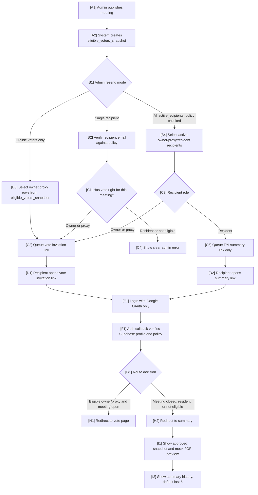

# Email Invite Flow

This document is the source of truth for invitation, resend, login redirect, and
summary routing decisions. Email event types, retry behavior, and delivery logs
remain in [Communication](communication.md). The wider voting lifecycle remains
in [Architecture](architecture.md) and [Voting flow](voting-flow.md).

## Node Descriptions

### [A1] Admin publishes meeting
Publishing a meeting is the trigger that freezes who can vote for that meeting.
Invitation and resend actions should not send vote links before the meeting has
a valid published voter snapshot.

### [A2] System creates eligible_voters_snapshot
`eligible_voters_snapshot` is the source of truth for meeting-specific voting
rights. Only rows with `voter_type` of `owner` or `proxy` can receive a vote
invitation link.

### [B1] Admin resend mode
Admin communications support two resend scopes:

- Single recipient: validate one entered email before sending.
- Group resend: send by policy-selected recipient groups.

The recommended default group mode is `Eligible voters only` because it limits
vote links to people who can act on them.

### [B2] Verify recipient email against policy
The entered email must resolve to a known profile or recipient record. The
system then checks meeting eligibility before sending a vote invitation link.
Failures should be shown directly in the admin UI, such as unknown email, no
profile, not eligible for this meeting, or meeting not published.

### [B3] Select owner/proxy rows from eligible_voters_snapshot
This group mode sends vote invitation links only to eligible owner/proxy rows
for the selected meeting.

### [B4] Select active owner/proxy/resident recipients
This group mode can include residents, but each recipient is still checked by
policy. Owner/proxy recipients receive vote invitation links. Residents receive
FYI summary links only.

### [C2] Queue vote invitation link
The vote invitation link should include a `next` target such as
`/vote/{meetingId}/{roomId}`. The link is not proof of voting rights; Supabase
auth and policy checks still run after login.

### [C5] Queue FYI summary link only
Residents do not receive vote links unless they are separately approved as a
proxy for the meeting. Their email should point to summary content only.

### [E1] Login with Google OAuth only
The login page should not expose an email OTP or generic magic-link form for
voting. Google OAuth establishes identity, then the application checks voting
rights in Supabase.

### [F1] Auth callback verifies Supabase profile and policy
After OAuth callback, the application ensures the profile exists and validates
the `next` target against the current user's meeting-specific rights.

### [G1] Route decision
An owner/proxy with an open meeting and matching room assignment can continue to
the vote page. Closed meetings, residents, missing eligibility, or invalid
targets route to summary instead.

### [I1] Show approved snapshot and mock PDF preview
Summary content must come from approved results through `committee_approvals`
and `result_snapshots`. In v1, show a mock PDF-style preview from the approved
snapshot before production PDF generation is available.

### [I2] Show summary history, default last 5
The summary page should expose recent approved meetings. The default history
limit is five meetings and should be configurable from admin settings.
